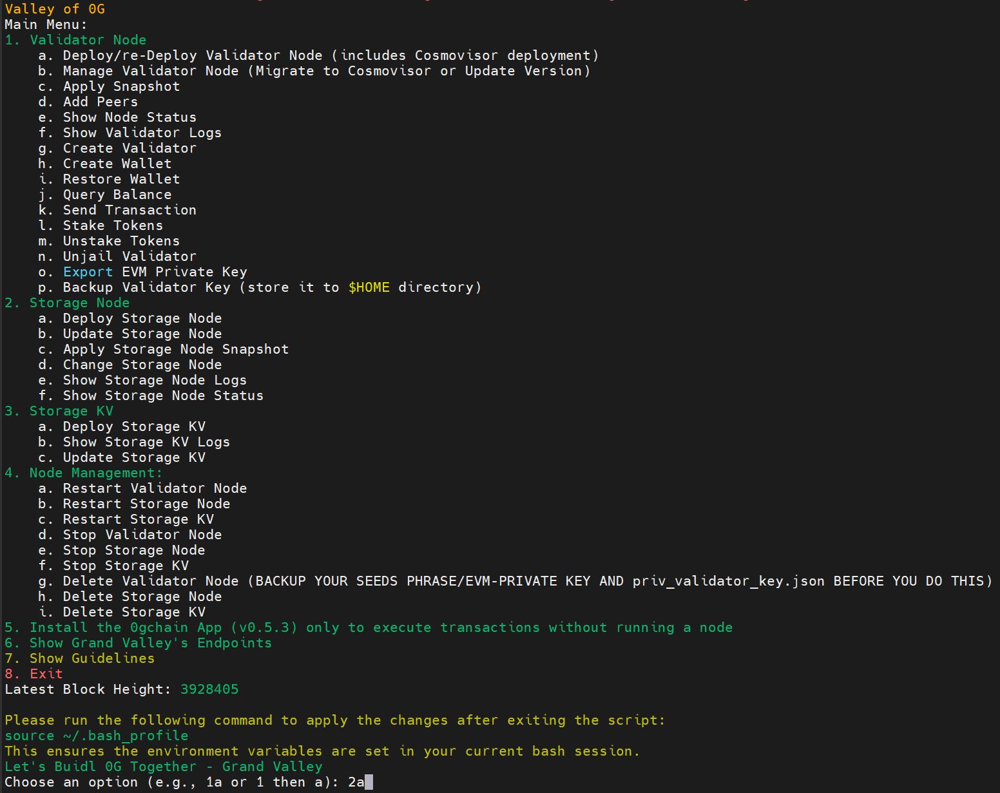

<p align="center">
  
</p>

<h1 align="center">Valley of 0G Testnet</h1>

<p align="center">
  <strong>Toolkit for deploying and managing 0G validator and storage nodes on Galileo testnet</strong>
</p>

<p align="center">
  <a href="https://0g.ai" target="_blank">0G Labs</a> •
  <a href="https://docs.0g.ai" target="_blank">Official Docs</a> •
  <a href="https://github.com/hubofvalley" target="_blank">Baconvalley</a>
</p>

---

## Overview

Valley of 0G Testnet is an open-source project by **Baconvalley** that provides automated scripts for deploying and managing 0G validator nodes and storage infrastructure on the **Galileo testnet**.

## System Requirements

### Validator Node
| Category | Requirements |
|----------|--------------|
| CPU | 8 cores |
| RAM | 64+ GB |
| Storage | 1+ TB NVMe SSD |
| Bandwidth | 100 MBit/s |

### Storage Node
| Category | Requirements |
|----------|--------------|
| CPU | 8+ cores |
| RAM | 32+ GB |
| Storage | 500GB-1TB NVMe SSD |
| Bandwidth | 100 MBit/s |

## Getting started

Run the main interactive menu:

```bash
bash <(curl -fsSL https://raw.githubusercontent.com/hubofvalley/Valley-of-0G-Testnet/main/resources/valleyof0G.sh)
```

Read-only health/configuration inspection is available without entering the interactive menu:

```bash
bash <(curl -fsSL https://raw.githubusercontent.com/hubofvalley/Valley-of-0G-Testnet/main/resources/valleyof0G.sh) doctor
bash <(curl -fsSL https://raw.githubusercontent.com/hubofvalley/Valley-of-0G-Testnet/main/resources/valleyof0G.sh) doctor --json
bash <(curl -fsSL https://raw.githubusercontent.com/hubofvalley/Valley-of-0G-Testnet/main/resources/valleyof0G.sh) doctor --strict
```

## Features

### Validator Node
- Deploy/re-deploy validator node
- Update node version
- Apply snapshot
- Add peers
- Show status and logs

### Storage Node
- Deploy/update storage node
- Apply storage snapshot (Turbo/Standard)
- Change configuration
- Show status and logs

### Storage KV
- Deploy/update Storage KV
- Show status and logs

## Current Versions

| Component | Version |
|-----------|---------|
| Validator Node | v3.0.4 (managed; newer upstream releases require review) |
| Storage Node | v1.1.0 |
| Storage KV | v1.4.0 |
| EVM Chain ID | 16602 (Galileo) |

## Baconvalley Public Endpoints

| Type | URL |
|------|-----|
| Cosmos RPC | `https://lightnode-rpc-0g.grandvalleys.com` |
| EVM RPC | `https://lightnode-json-rpc-0g.grandvalleys.com` |
| Cosmos REST API | `https://lightnode-api-0g.grandvalleys.com` |
| Peer | `a97c8615903e795135066842e5739e30d64e2342@peer-0g.grandvalleys.com:28656` |
| Explorer | `https://explorer.grandvalleys.com` |

## Privacy & Security

- **No external data storage** - All operations run locally
- **No phishing links** - All URLs are for legitimate 0G operations
- **Open source** - Full audit trail available

## Documentation

For detailed documentation, see the [docs/](docs/) folder.

## Links

**0G Labs:**
- [Website](https://0g.ai) | [Docs](https://docs.0g.ai) | [X/Twitter](https://x.com/0G_labs)

**Baconvalley:**
- [GitHub](https://github.com/hubofvalley) | [X/Twitter](https://x.com/bacvalley)

## Contact

Email: letsbuidltogether@grandvalleys.com

## License

This project is licensed under the MIT License - see the [LICENSE](LICENSE) file for details.
